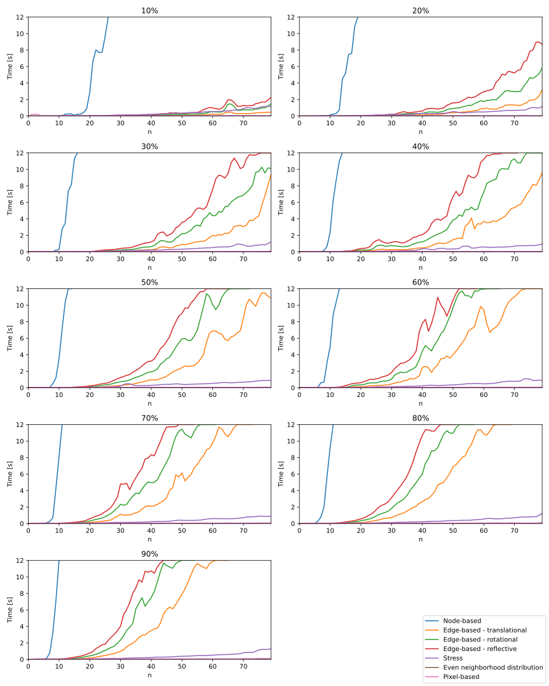
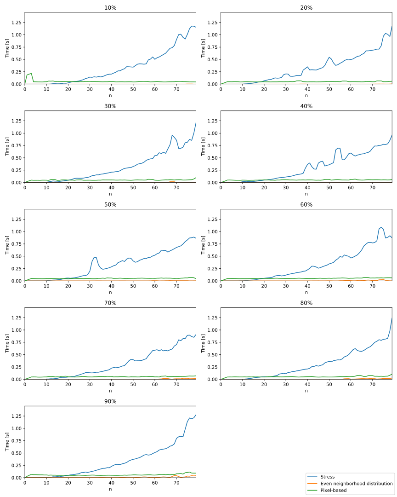
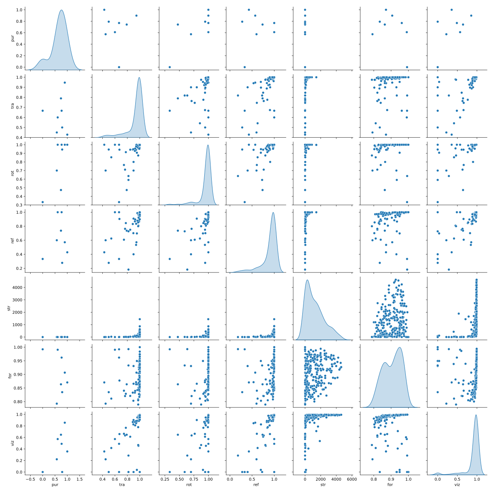
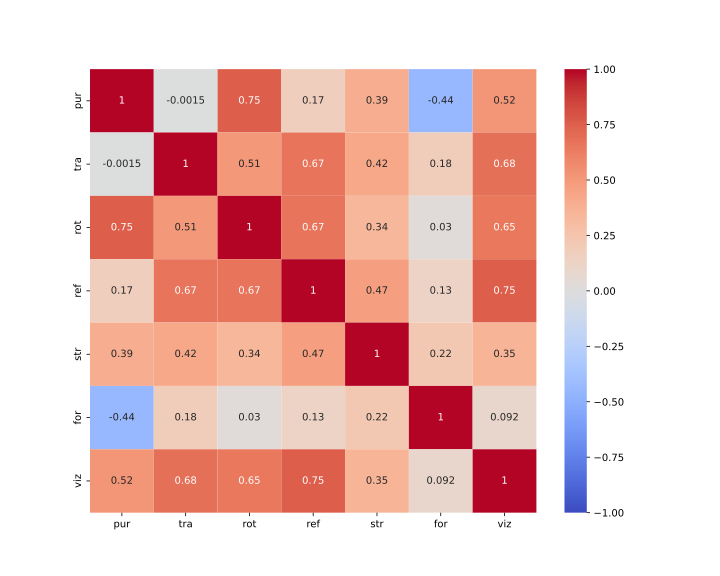
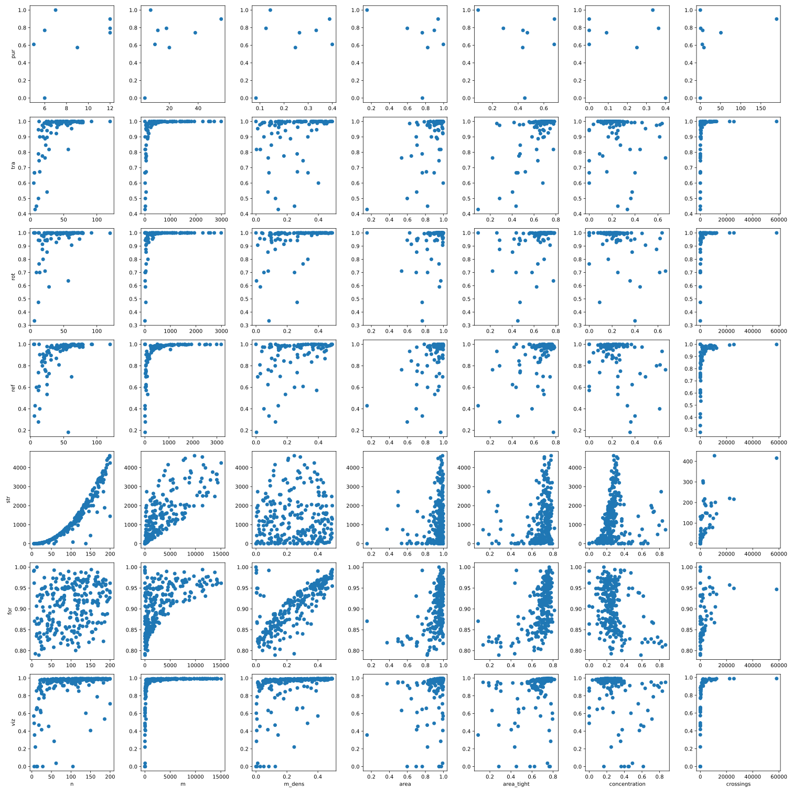
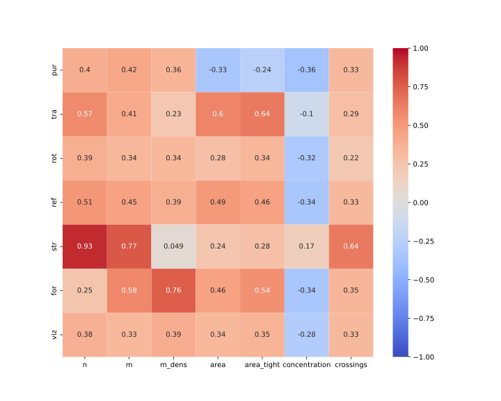

Which symmetry metric to choose?
================================

The proposed symmetry metrics vary fundamentaly in their approach.
This page tries to give an overview of all symmetry metrics for graph drawings previously published in order to ease the decision on what metric might be most suitable for your specific use case.

In general we distinquish for different types of symmetry - reflective, rotational, translative and dihedral.

An overview of all identified symmetry metrics can be seen in the table below, most of which are implemented in gdMetriX.

TABLE GOES HERE

Runtime
-------

Especially when used iteratively in an automatic embedder, a symmetry metric has to be quick to obtain.
However, especially the node- and edge-based metrics - with a runtime of :math:`O(n^7)` and :math:`O(m^2)` respectively are infeasible to obtain for bigger instances.

To compare the runtime, we generated random graphs with edge densities from 10% up to 90% (see the figure below).

  Runtime comparison of all metrics

When focusing only on the faster metrics, we can see that the stress-based approach takes a bit longer compared to the rest. This is due to the additional binary search that is done to minimize the final metric as discussed above.

  Runtime comparison of the faster metrics

Correlation
-----------

In case all metrics are capable of measuring some sense of symmetry, we expect that they exhibit some extend of correlation.

The correlation between all symmetry metrics are depicted below.
The data consists of random graphs embedded using the force-based embedder from networkX.

  Scatter plot between all implemented symmetry metrics

  Correlation matrix between all implemented symmetry metrics

Correlation to other metrics
----------------------------

Some symmetry metrics might highly depend on, i.e., the density or size of a graph.

See the scatter plot below to evaluate of a specific metric is right for you.

  Scatter plot between all implemented symmetry metrics