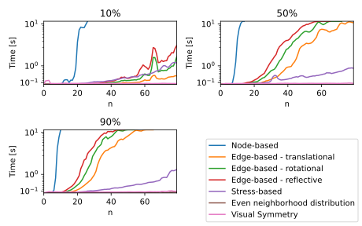
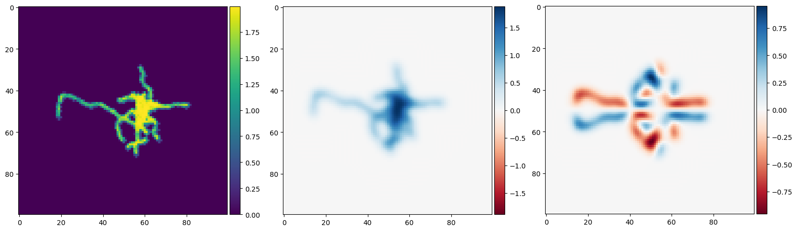
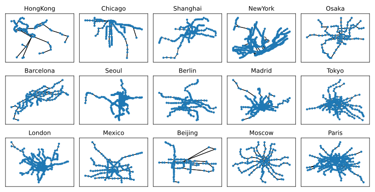

*networkX* is a well established Python library for network analysis.
With *gdMetriX*, we aim to extend the functionality of *networkX*
and provide common metrics used in the field of graph drawing.
In addition, the package provides
an easy-to-use access to the the ’Graph Layout
Benchmark Datasets’ project.

|

Working with gdMetriX
=====================

*gdMetriX* works with all types of graphs provided by *networkX*.
The node positions are expected as tuples stored as node attributes
with the name `"pos"`. All drawings are assumed to be straight-line drawings.

..
    You can set the attributes using *networkX*:

.. code:: python

   import networkx as nx
   import gdMetriX

   g = nx.Graph()
   g.add_node('nodeA', pos=(0, 3.5))
   g.add_node('nodeB', pos=(-3, 3))

In order to calculate a metric, simply call the respective function:

.. code:: python

   crossing_quality = gdMetriX.crossing_metric(g)

..
    The node positions are automatically read from the graph attributes. You can also
    supply them directly:

    .. code:: python

       pos = {'nodeA': (0, 3.5), 'nodeB': (-3, 3), 'nodeC': (0, 0)}
       crossing_quality = gdMetriX.crossing_density(g, pos)
       print(crossing_quality)

|

Loading Datasets
================

Support for automatic import of datasets (including embeddings) from the `Graph Layout Benchmark
Datasets <https://visdunneright.github.io/gd_benchmark_sets/>`__ project [1] with a single line of code:

..
    *gdMetriX* supports the automatic import of graph drawing datasets with a single line of code.

    The datasets are collected from the `Graph Layout Benchmark
    Datasets <https://visdunneright.github.io/gd_benchmark_sets/>`__ project
    from the *Northeastern University Visualization Lab* [1].
    The project aims to collect datasets used for graph layout algorithms
    and make them available for long-term access.

    To get a list of all available datasets, call `gdMetriX.get_available_datasets()`:

    .. code:: python

       >> available_datasets = gdMetriX.get_available_datasets()
       >> print(available_datasets)
       ['subways', 'code', 'rome', 'chess', 'steinlib', ...

    To load graphs from a given dataset, simply call `gdMetriX.get_list_of_graphs()`.
    *gdMetriX* takes care of the rest including downloading, parsing and caching.

.. code:: python

   for graph in gdMetriX.get_list_of_graphs('subways'):
      print(graph.nodes())

|

Implemented Metrics
===================

..
    While we do not claim completeness, the goal was to identify all established
    and well-defined metrics described in literature.

Indispensable for collecting a set of suitable metrics
were the publications by Taylor and Rodgers [2], Purchase [3], Bennett et al. [4], as well as by Mooneyet et al. [5].

|

Crossings
---------

+---------------------------------------------------+-----------------------------------------------------------------------------------------------------------------------------------------------------------------------------------------------------------------------------------------------------------------------+----------------------+-------------------------------------------+
| Metric                                            | Description                                                                                                                                                                                                                                                           | Range                |                                           |
+===================================================+=======================================================================================================================================================================================================================================================================+======================+===========================================+
| **Crossing number**                               | Implementation of the Bentley-Ottmann algorithm running in :math:`O((n+k) \log n)` time                                                                                                                                                                               | :math:`[0, |E|^2]`   |  [6]                                      |
+---------------------------------------------------+-----------------------------------------------------------------------------------------------------------------------------------------------------------------------------------------------------------------------------------------------------------------------+----------------------+-------------------------------------------+
| **Crossing density**                              | Total number of crossings divided by the maximum number of possible crossings                                                                                                                                                                                         | [0,1]                |  [5]                                      |
|                                                   |                                                                                                                                                                                                                                                                       |                      |                                           |
|                                                   | .. image:: crossings.svg                                                                                                                                                                                                                                              |                      |                                           |
|                                                   |                                                                                                                                                                                                                                                                       |                      |                                           |
+---------------------------------------------------+-----------------------------------------------------------------------------------------------------------------------------------------------------------------------------------------------------------------------------------------------------------------------+----------------------+-------------------------------------------+
| **Crossing angles**                               | List of all angles between pairwise crossing edges                                                                                                                                                                                                                    | :math:`[0, \pi]`     |  [7]                                      |
+---------------------------------------------------+-----------------------------------------------------------------------------------------------------------------------------------------------------------------------------------------------------------------------------------------------------------------------+----------------------+-------------------------------------------+
| **Crossing angular resolution**                   | Average deviation from the optimal angle between two edges in any of the crossings                                                                                                                                                                                    | [0,1]                |  [7]                                      |
+---------------------------------------------------+-----------------------------------------------------------------------------------------------------------------------------------------------------------------------------------------------------------------------------------------------------------------------+----------------------+-------------------------------------------+

Area and Boundary
-----------------

+---------------------------------------------------+-----------------------------------------------------------------------------------------------------------------------------------------------------------------------------------------------------------------------------------------------------------------------+--------------------------------+-------------------------------------------+
| Metric                                            | Description                                                                                                                                                                                                                                                           | Range                          |                                           |
+===================================================+=======================================================================================================================================================================================================================================================================+================================+===========================================+
| **Area**                                          | Size of an axis-aligned rectangular bounding box                                                                                                                                                                                                                      | :math:`ℝ`                      | [2]                                       |
+---------------------------------------------------+-----------------------------------------------------------------------------------------------------------------------------------------------------------------------------------------------------------------------------------------------------------------------+--------------------------------+-------------------------------------------+
| **Tight area**                                    | Size of the convex hull of the graph                                                                                                                                                                                                                                  | :math:`ℝ`                      | [2]                                       |
+---------------------------------------------------+-----------------------------------------------------------------------------------------------------------------------------------------------------------------------------------------------------------------------------------------------------------------------+--------------------------------+-------------------------------------------+
| **Aspect ratio**                                  | Proportion between the smaller and the bigger side of the axis-aligned rectangular bounding box containing the graph                                                                                                                                                  | [0,1]                          | [2]                                       |
+---------------------------------------------------+-----------------------------------------------------------------------------------------------------------------------------------------------------------------------------------------------------------------------------------------------------------------------+--------------------------------+-------------------------------------------+

Node Distribution
-----------------

+---------------------------------------------------+-----------------------------------------------------------------------------------------------------------------------------------------------------------------------------------------------------------------------------------------------------------------------+--------------------------------+-------------------------------------------+
| Metric                                            | Description                                                                                                                                                                                                                                                           | Range                          |                                           |
+===================================================+=======================================================================================================================================================================================================================================================================+================================+===========================================+
| **Center of mass**                                | Average position of all nodes, optionally weighted by a weight vector.                                                                                                                                                                                                | :math:`ℝ^2`                    |                                           |
+---------------------------------------------------+-----------------------------------------------------------------------------------------------------------------------------------------------------------------------------------------------------------------------------------------------------------------------+--------------------------------+-------------------------------------------+
| **Closest pair of points**                        | Closest pair of nodes in the drawing                                                                                                                                                                                                                                  | :math:`V^2`                    | [8]                                       |
+---------------------------------------------------+-----------------------------------------------------------------------------------------------------------------------------------------------------------------------------------------------------------------------------------------------------------------------+--------------------------------+-------------------------------------------+
| **Closest pair of elements**                      | Closest pair of graph elements, i.e. points and edges.                                                                                                                                                                                                                | :math:`(V \cup E)^2`           | [8]                                       |
+---------------------------------------------------+-----------------------------------------------------------------------------------------------------------------------------------------------------------------------------------------------------------------------------------------------------------------------+--------------------------------+-------------------------------------------+
| **Con- centration**                               | How evenly nodes are spread among the bounding box                                                                                                                                                                                                                    | [0,1]                          | [2]                                       |
|                                                   |                                                                                                                                                                                                                                                                       |                                |                                           |
|                                                   | .. image:: concentration.svg                                                                                                                                                                                                                                          |                                |                                           |
|                                                   |                                                                                                                                                                                                                                                                       |                                |                                           |
+---------------------------------------------------+-----------------------------------------------------------------------------------------------------------------------------------------------------------------------------------------------------------------------------------------------------------------------+--------------------------------+-------------------------------------------+
| **Homogeneity**                                   | How evenly nodes are distributed among the four quadrants.                                                                                                                                                                                                            | [0,1]                          | [2]                                       |
|                                                   |                                                                                                                                                                                                                                                                       |                                |                                           |
|                                                   | .. image:: homogeneity.svg                                                                                                                                                                                                                                            |                                |                                           |
|                                                   |                                                                                                                                                                                                                                                                       |                                |                                           |
+---------------------------------------------------+-----------------------------------------------------------------------------------------------------------------------------------------------------------------------------------------------------------------------------------------------------------------------+--------------------------------+-------------------------------------------+
|                                                   |                                                                                                                                                                                                                                                                       |                                |                                           |
| **Balance**                                       | Node distribution above/below axis line.                                                                                                                                                                                                                              | [-1,1]                         | [9]                                       |
|                                                   |                                                                                                                                                                                                                                                                       |                                |                                           |
|                                                   | .. image:: balance.svg                                                                                                                                                                                                                                                |                                |                                           |
|                                                   |                                                                                                                                                                                                                                                                       |                                |                                           |
+---------------------------------------------------+-----------------------------------------------------------------------------------------------------------------------------------------------------------------------------------------------------------------------------------------------------------------------+--------------------------------+-------------------------------------------+
| **Node orthogonality**                            | How grid-like the nodes are.                                                                                                                                                                                                                                          | [0,1]                          | [3]                                       |
|                                                   |                                                                                                                                                                                                                                                                       |                                |                                           |
|                                                   | .. image:: orthogonality.svg                                                                                                                                                                                                                                          |                                |                                           |
|                                                   |                                                                                                                                                                                                                                                                       |                                |                                           |
+---------------------------------------------------+-----------------------------------------------------------------------------------------------------------------------------------------------------------------------------------------------------------------------------------------------------------------------+--------------------------------+-------------------------------------------+
| **Gabriel ratio**                                 | The percentage of nodes falling outside a minimum circle covering an edge for any edge.                                                                                                                                                                               | [0,1]                          | [5]                                       |
|                                                   |                                                                                                                                                                                                                                                                       |                                |                                           |
|                                                   |  .. image:: gabriel.svg                                                                                                                                                                                                                                               |                                |                                           |
|                                                   |                                                                                                                                                                                                                                                                       |                                |                                           |
+---------------------------------------------------+-----------------------------------------------------------------------------------------------------------------------------------------------------------------------------------------------------------------------------------------------------------------------+--------------------------------+-------------------------------------------+

Edge Directions
---------------

+---------------------------------------------------+-----------------------------------------------------------------------------------------------------------------------------------------------------------------------------------------------------------------------------------------------------------------------+-------------------------------+-------------------------------------------+
| Metric                                            | Description                                                                                                                                                                                                                                                           | Range                         |                                           |
+===================================================+=======================================================================================================================================================================================================================================================================+===============================+===========================================+
| **Angular resolution**                            | Average deviation from the optimal angle between any two adjacent edges                                                                                                                                                                                               | [0,1]                         | [7]                                       |
|                                                   |                                                                                                                                                                                                                                                                       |                               |                                           |
|                                                   | .. image:: angular_resolution.svg                                                                                                                                                                                                                                     |                               |                                           |
|                                                   |                                                                                                                                                                                                                                                                       |                               |                                           |
+---------------------------------------------------+-----------------------------------------------------------------------------------------------------------------------------------------------------------------------------------------------------------------------------------------------------------------------+-------------------------------+-------------------------------------------+
| **Average flow**                                  | Average edge direction of a directed graph.                                                                                                                                                                                                                           | :math:`ℝ^2`                   | [4]                                       |
+---------------------------------------------------+-----------------------------------------------------------------------------------------------------------------------------------------------------------------------------------------------------------------------------------------------------------------------+-------------------------------+-------------------------------------------+
| **Upwards flow**                                  | Percentage of edges pointing ’upwards’, i.e. the angle between the edge and the upward vector is <90°. For directed graphs.                                                                                                                                           | [0,1]                         | [3]                                       |
|                                                   |                                                                                                                                                                                                                                                                       |                               |                                           |
|                                                   | .. image:: upwards_flow.svg                                                                                                                                                                                                                                           |                               |                                           |
|                                                   |                                                                                                                                                                                                                                                                       |                               |                                           |
+---------------------------------------------------+-----------------------------------------------------------------------------------------------------------------------------------------------------------------------------------------------------------------------------------------------------------------------+-------------------------------+-------------------------------------------+
| **Coherence to average flow**                     | Upwards flow with the average flow as the ’upwards’ direction. For directed graphs.                                                                                                                                                                                   | [0,1]                         | [3]                                       |
+---------------------------------------------------+-----------------------------------------------------------------------------------------------------------------------------------------------------------------------------------------------------------------------------------------------------------------------+-------------------------------+-------------------------------------------+
| **Edge orthogonality**                            | Extent to which the edges are vertically or horizontally aligned.                                                                                                                                                                                                     | [0,1]                         | [3]                                       |
|                                                   |                                                                                                                                                                                                                                                                       |                               |                                           |
|                                                   | .. image:: edge_orthogonality.svg                                                                                                                                                                                                                                     |                               |                                           |
|                                                   |                                                                                                                                                                                                                                                                       |                               |                                           |
+---------------------------------------------------+-----------------------------------------------------------------------------------------------------------------------------------------------------------------------------------------------------------------------------------------------------------------------+-------------------------------+-------------------------------------------+

Symmetry
--------

+---------------------------------------------------+-----------------------------------------------------------------------------------------------------------------------------------------------------------------------------------------------------------------------------------------------------------------------+---------------------+-------------------------------------------+
| Metric                                            | Description                                                                                                                                                                                                                                                           | Runtime             |                                           |
+===================================================+=======================================================================================================================================================================================================================================================================+=====================+===========================================+
| **Node-based symmetry**                           | Estimates reflective symmetry by checking for symmetry axes along each pair of nodes.                                                                                                                                                                                 | :math:`O(n^7)`      |  [3]                                      |
+---------------------------------------------------+-----------------------------------------------------------------------------------------------------------------------------------------------------------------------------------------------------------------------------------------------------------------------+---------------------+-------------------------------------------+
| **Edge-based symmetry**                           | Based on edge positions, estimates reflective, rotational or translational symmetry.                                                                                                                                                                                  | :math:`O(m^2)`      | [10]                                      |
+---------------------------------------------------+-----------------------------------------------------------------------------------------------------------------------------------------------------------------------------------------------------------------------------------------------------------------------+---------------------+-------------------------------------------+
| **Stress-based symmetry**                         | Standard definition of stress, which correlates with symmetry.                                                                                                                                                                                                        | :math:`O(n^2)`      | [11]                                      |
+---------------------------------------------------+-----------------------------------------------------------------------------------------------------------------------------------------------------------------------------------------------------------------------------------------------------------------------+---------------------+-------------------------------------------+
| **Even neigh- borhood distribution**              | Estimates how evenly the neighborhood of each vertex is distributed around the barycenter of the neighborhood.                                                                                                                                                        | :math:`O(n^2)`      | [12]                                      |
+---------------------------------------------------+-----------------------------------------------------------------------------------------------------------------------------------------------------------------------------------------------------------------------------------------------------------------------+---------------------+-------------------------------------------+
| **Visual symmetry**                               | Draws a constant-size image of the graph and estimates symmetry in a pixel-based manner.                                                                                                                                                                              | :math:`O(n + m)`    |  No- vel                                  |
+---------------------------------------------------+-----------------------------------------------------------------------------------------------------------------------------------------------------------------------------------------------------------------------------------------------------------------------+---------------------+-------------------------------------------+

Some symmetry metrics are infeasible to obtain for certain use cases (see Fig. 1).
Therefore, we have implemented an additional symmetry estimate (named "visual symmetry"), which uses a constant size pixel drawing of the graph as a basis (see Fig. 2).
The measure subtracts rotated/translated/mirrored versions of the image and sums the ink left.

  Fig. 1: Runtime of symmetry metrics with edge densities of 10-90%

|

  Fig. 2: Visual symmetry metric – step by step

|

      Fig. 3: Various subway maps ordered by visual symmetry from low to high.

..
    Examples
    ========

    Let us use *gdMetriX* to investigate some subway maps of famous cities, because who does not like trains.
    Luckily, there is a dataset readily available, which we can download with a single line of code:

    .. code:: python

        subways = list(gdMetriX.iterate_dataset('subways'))

    Maybe we want to know which subway has the most symmetric structure.

    .. code:: python

        symmetry = {key: gdMetriX.visual_symmetry(value) for key, value in subways}

    According to the visual symmetry metric, Paris has the highest symmetry value (0.90) and Hong Kong the lowest (0.55)
    (see Fig. 3).

    .. figure::  symmetry_sorted.svg
      :width: 100%
      :align: center
      :alt: Fig. 3: Various subway maps ordered by symmetry from low to high.

      Fig. 3: Various subway maps ordered by symmetry from low to high.

    |

    To identify less developed areas of a city, we plot the distance
    between stations (i.e. the edge length) on a heatmap using the
    heatmap function from *gdMetriX*:

    .. code:: python

       for name, g in subways:
           pos = gdMetriX.get_node_positions(g)
           edge_lengths = [gdMetriX.euclidean_distance(pos[edge[0]],
                        pos[edge[1]]) for edge in g.edges()]
           edge_pos = [gdMetriX.Vector.from_point(pos[edge[0]]).mid(
                        gdMetriX.Vector.from_point(pos[edge[1]])) for edge in g.edges()]

           heatmap = gdMetriX.heatmap(g, edge_pos, edge_lengths, 20)
           ax.imshow(heatmap, cmap='viridis', interpolation='nearest')

    .. figure::  subways_edge_length.svg
      :width: 100%
      :align: center
      :alt: Fig. 4: Heatmap over the edge lengths of various subway maps.

      Fig. 4: Heatmap over the edge lengths of various subway maps.

|

Participation & Feedback
========================

We hope to be able to actively maintain the project. Whether you are missing a feature, spotted a bug, or want to participate, do not hesitate to contact us.

.. class:: qrtable

+----------------------------------------------------------------------------------------------------------------------------------------------------------------------------+--------------------------------------+
|                                                                                                                                                                            | .. image:: qr-code.svg               |
|                                                                                                                                                                            |                                      |
| | Mail: sebastian.roeder@student.tuwien.ac.at                                                                                                                              |                                      |
|                                                                                                                                                                            |                                      |
| | GitHub: https://github.com/livus/gdMetriX                                                                                                                                |                                      |
|                                                                                                                                                                            |                                      |
| | Documentation: https://livus.github.io/gdMetriX/                                                                                                                         |                                      |
|                                                                                                                                                                            |                                      |
| | PyPI: https://pypi.org/project/gdMetriX/                                                                                                                                 |                                      |
|                                                                                                                                                                            |                                      |
+----------------------------------------------------------------------------------------------------------------------------------------------------------------------------+--------------------------------------+

.. [1] S\. Di Bartolomeo, E. Puerta, C. Wilson, T. Crnovrsanin, and C. Dunne, "A Collection of Benchmark Datasets for Evaluating Graph Layout Algorithms", Graph Drawing Posters, 2023. [Online]. Available: https://visdunneright.github.io/gd_benchmark_sets/
.. [2] M\. Taylor and P. Rodgers. "Applying graphical design techniques to graph visualisation". In *Ninth International Conference on Information Visualisation (IV'05)*, 651–656. IEEE, 2005. doi:10.1109/IV.2005.19.
.. [3] H\. C. Purchase. "Metrics for Graph Drawing Aesthetics". In *Journal of Visual Languages & Computing*, 13(5):501–516, October 2002. doi:10.1006/jvlc.2002.0232.
.. [4] C\. Bennett, J. Ryall, L. Spalteholz, and A. Gooch. "The Aesthetics of Graph Visualization". In *Computational Aesthetics in Graphics*, 2007. doi:10.2312/COMPAESTH/COMPAESTH07/057-064.
.. [5] G\. J. Mooney, H. C. Purchase, M. Wybrow, and S. G. Kobourov. "The Multi-dimensional Landscape of Graph Drawing Metrics". In *17th IEEE Pacific Visualization Symposium*. Pacific Visualization 2024, 2024.
.. [6] H\. C. Purchase, R. F. Cohen, and M. James. "Validating Graph Drawing Aesthetics". In *Graph Drawing*, 435–446. Berlin, Heidelberg, 1996. Springer Berlin Heidelberg. doi:10.1007/bfb0021827.
.. [7] M\. K. Coleman and D. S. Parker. "Aesthetics-based Graph Layout for Human Consumption". In *Software: Practice and Experience*, 26(12):1415–1438, December 1996. doi: 10.1002/(SICI)1097-024X(199612)26:12<1415::AID-SPE69>3.0.CO;2-P.
.. [8] M\. Burch. "The Aesthetics of Diagrams". In *Proceedings of the 6th International Conference on Information Visualization Theory and Applications - Volume 1: IVAPP, (VISIGRAPP 2015)*, pp. 262–267. INSTICC, SciTePress, 2015. doi:10.5220/0005357502620267.
.. [9] R\. Tamassia, G. Di Battista, and C. Batini. "Automatic Graph Drawing and Readability of Diagrams". In *IEEE Transactions on Systems, Man, and Cybernetics*, 18(1):61–79, 1988. doi:10.1109/21.87055.
.. [10] R\. Klapaukh, S. Marshall, and D. Pearce. "A Symmetry Metric for Graphs and Line Diagrams". In *Diagrammatic Representation and Inference*, volume 10871, pp. 739–742, 2018. doi:10.1007/978-3-319-91376-6_71.
.. [11] E\. Welch and S. Kobourov. "Measuring Symmetry in Drawings of Graphs". In *Computer Graphics Forum*, 36(3):341–351, June 2017. doi:10.1111/cgf.13192.
.. [12] T\. Xu, J. Yang, and G. Gou. "A Force-Directed Algorithm for Drawing Directed Graphs Symmetrically". In *Mathematical Problems in Engineering*, 2018:1–24, November 2018. doi:10.1155/2018/6208509.
