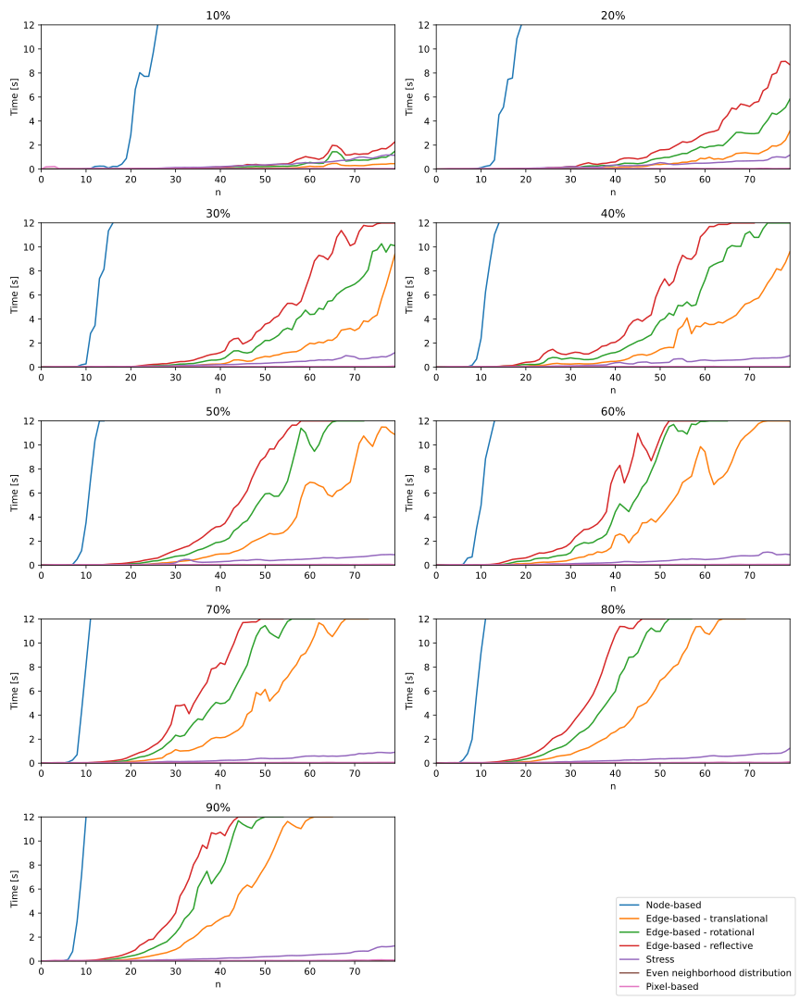

GD Poster Test
==============

* This is a bulleted list.
* It has two items, the second
  item uses two lines.

1. This is a numbered list.
2. It has two items too.

#. This is a numbered list.
#. It has two items too.

| These lines are
| broken exactly like in
| the source file.

This is a normal text paragraph. The next paragraph is a code sample::

   It is not processed in any way, except
   that the indentation is removed.

   It can span multiple lines.

This is a normal text paragraph again

+------------------------+------------+----------+----------+
| Header row, column 1   | Header 2   | Header 3 | Header 4 |
| (header rows optional) |            |          |          |
+========================+============+==========+==========+
| body row 1, column 1   | column 2   | column 3 | column 4 |
+------------------------+------------+----------+----------+
| body row 2             | ...        | ...      |          |
+------------------------+------------+----------+----------+

=====  =====  =======
A      B      A and B
=====  =====  =======
False  False  False
True   False  False
False  True   False
True   True   True
=====  =====  =======

This is a paragraph that contains `a link`_.

.. _a link: https://domain.invalid/

=================
This is a heading
=================

Loading datasets
~~~~~~~~~~~~~~~~

gdMetriX supports the automatic import of graph drawing datasets. The
datasets are collected from the `Graph Layout Benchmark
Datasets <https://visdunneright.github.io/gd_benchmark_sets/>`__ project
from the Northeastern University Visualization Lab easily accessible for
networkX.

The project aims to collect datasets used for graph layout algorithms
and make them available for long-term access. The graphs are stored on
the `Open Science Foundation platform <https://osf.io/j7ucv/>`__.

Information about the individual datasets can be found at the `project
homepage <https://visdunneright.github.io/gd_benchmark_sets/%3E>`__.

To get a list of all available datasets:

.. code:: python

   >> > available_datasets = get_available_datasets()
   >> > print(available_datasets)
   ['subways', 'code', 'rome', 'chess', 'steinlib', ...

To iterate over all graphs of a given dataset, simply call `gdMetriX.get_list_of_graphs()`:

.. code:: python

   >> > for graph in gdMetriX.get_list_of_graphs('subways'):
       >> > print(graph.nodes())

License
-------

The project is distributed under the GNU General Public License version 3.

Citing
------

If you find this project useful for your work, consider citing it::

    @Misc{Noellenburg2024gdMetriX,
        author       = {Martin Nöllenburg, Markus Wallinger, Sebastian Röder},
        howpublished = {Under submission to Graph Drawing Posters},
        title        = {gdMetriX},
        year         = {2024},
        url          = {https://livus.github.io/gdMetriX/},
    }

Importing datasets
~~~~~~~~~~~~~~~~~~~~~~

+---------------+---------------------------------------------------------------------------------------------------------------------------------------------------------------------------------------------------------+------------------------------+
| Feature       | Description                                                                                                                                                                                             | Implementation               |
+===============+=========================================================================================================================================================================================================+==============================+
| Load datasets | Load a dataset from the `Graph Layout Benchmark Datasets <https://visdunneright.github.io/gd_benchmark_sets/>`_ project from the Northeastern University Visualization Lab and parse it for easy usage. |                              |
+---------------+---------------------------------------------------------------------------------------------------------------------------------------------------------------------------------------------------------+------------------------------+

We use an adapted set of styles based on Pygments. Here are some examples, you can apply the built-in styles as you wish.

Python example: Flask minimal example

.. code:: python

    from flask import Flask
    app = Flask(__name__)

    @app.route('/')
    def hello_world():
        return 'Hello, World!'

PHP example: Slim Framework minimal example

.. code:: php

    <?php
    use Psr\Http\Message\ResponseInterface as Response;
    use Psr\Http\Message\ServerRequestInterface as Request;
    use Slim\Factory\AppFactory;

    require __DIR__ . '/../vendor/autoload.php';

    $app = AppFactory::create();

    $app->get('/hello/{name}', function (Request $request, Response $response, array $args) {
        $name = $args['name'];
        $response->getBody()->write("Hello, $name");
        return $response;
    });

    $app->run();

Go example

.. code:: go

    package main

    import "fmt"

    func main() {

      var favoriteSnack string

      favoriteSnack = "Cheese"

      fmt.Println("My favorite snack is " + favoriteSnack)

    }

+--------------------------------+-------------------------------------+---------------------+--------+-----------+----------+
|             Metric             | Type of symmetry                    | Runtime             | Scope  | Robust    | Faithful |
+================================+=====================================+=====================+========+===========+==========+
| Node-based symmetry            | Reflective                          | :math:`O(n^7)`      | Both   | Partially | No       |
+--------------------------------+-------------------------------------+---------------------+--------+-----------+----------+
| Edge-based symmetry            | Reflective, translative, rotational | :math:`O(m^2)`      | Both   | No        | No       |
+--------------------------------+-------------------------------------+---------------------+--------+-----------+----------+
| Stress                         | n.a.                                | :math:`O(n^2)`      | Local  | Yes       | Yes      |
+--------------------------------+-------------------------------------+---------------------+--------+-----------+----------+
| Even neighborhood distribution | n.a.                                | :math:`O(n^2)`      | Local  | Yes       | Yes      |
+--------------------------------+-------------------------------------+---------------------+--------+-----------+----------+
| Automorphism detection         | Reflective, translational           | :math:`O(n \log n)` | Local  | Yes       | Yes      |
+--------------------------------+-------------------------------------+---------------------+--------+-----------+----------+
| Pixel-based symmetry           | Reflective, rotational, dihedral    | :math:`O(n + m)`    | Global | No        | No       |
+--------------------------------+-------------------------------------+---------------------+--------+-----------+----------+

Especially when used iteratively in an automatic embedder, a symmetry metric has to be quick to obtain.
However, especially the node- and edge-based metrics - with a runtime of :math:`O(n^7)` and :math:`O(m^2)` respectively are infeasible to obtain for bigger instances.

To compare the runtime, we generated random graphs with edge densities from 10% up to 90% (see the figure below).

  Runtime comparison of all metrics

When focusing only on the faster metrics, we can see that the stress-based approach takes a bit longer compared to the rest. This is due to the additional binary search that is done to minimize the final metric as discussed above.

.. figure:: ../doc/images/sym_runtime.svg
  :width: 90%
  :align: center
  :alt: Runtime comparison of the faster metrics

  Runtime comparison of the faster metrics

Consequuntur velit nisi consequuntur illo. Sit nemo vel quae eligendi iste. Architecto perspiciatis illo tempore in iusto molestias facilis nihil. Totam natus nulla rerum minima et. Praesentium dolor quis aut modi enim consequatur amet.

Sapiente vel sit modi in sint. Repellendus beatae hic velit rerum. Qui nisi adipisci sint cum odit ut fugit fugit. Et eos nihil in qui alias a consequatur tempora.

Possimus ducimus in quae suscipit ipsam. Ut distinctio aspernatur nulla dignissimos provident fugiat. Hic in enim quas. Quasi aut similique non. Doloremque ea sed eveniet.

Incidunt architecto nam rem accusantium. Et illo dicta voluptatem ut molestiae et. Fugit architecto est voluptatibus explicabo consequatur est.

Quaerat sequi sed sed asperiores. Nostrum ad veniam velit officiis explicabo quis iure. Quibusdam quod natus dolor et ea sed et velit. Maiores blanditiis unde fugiat voluptatibus facilis voluptas. Ullam magnam accusamus ullam consequatur incidunt illum in. Ipsa adipisci qui at.

Consequuntur velit nisi consequuntur illo. Sit nemo vel quae eligendi iste. Architecto perspiciatis illo tempore in iusto molestias facilis nihil. Totam natus nulla rerum minima et. Praesentium dolor quis aut modi enim consequatur amet.

Sapiente vel sit modi in sint. Repellendus beatae hic velit rerum. Qui nisi adipisci sint cum odit ut fugit fugit. Et eos nihil in qui alias a consequatur tempora.

Possimus ducimus in quae suscipit ipsam. Ut distinctio aspernatur nulla dignissimos provident fugiat. Hic in enim quas. Quasi aut similique non. Doloremque ea sed eveniet.

Incidunt architecto nam rem accusantium. Et illo dicta voluptatem ut molestiae et. Fugit architecto est voluptatibus explicabo consequatur est.

Quaerat sequi sed sed asperiores. Nostrum ad veniam velit officiis explicabo quis iure. Quibusdam quod natus dolor et ea sed et velit. Maiores blanditiis unde fugiat voluptatibus facilis voluptas. Ullam magnam accusamus ullam consequatur incidunt illum in. Ipsa adipisci qui at.

